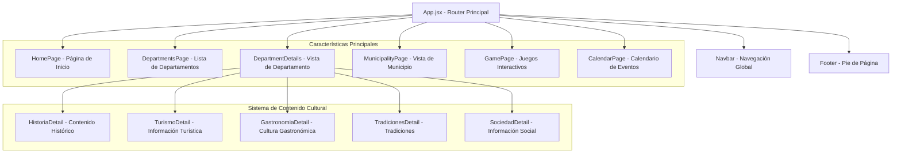
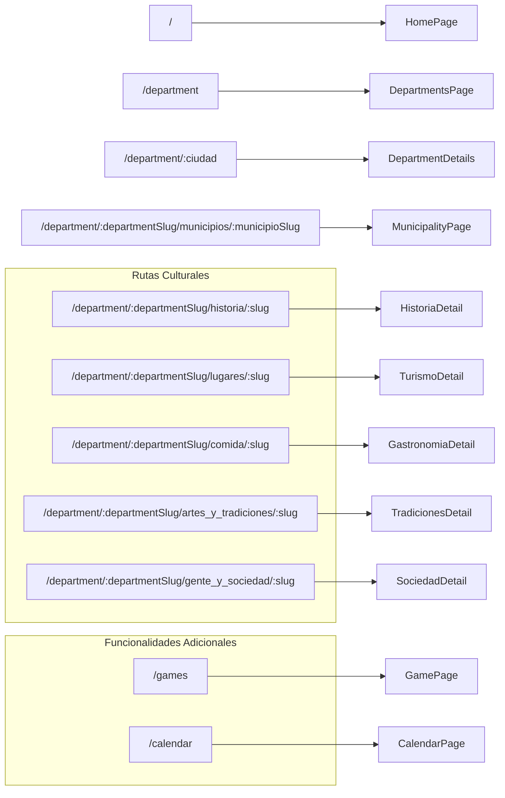

## Pinolito

**Pinolito** es una aplicación web interactiva desarrollada con **React(JS) + Vite** que permite explorar la riqueza cultural de los departamentos de Nicaragua apoyada en mapas y una interfaz dinámica.

Permite explorar la riqueza cultural de Nicaragua, mostrando información organizada por departamentos y municipios, en categorías como: **historia, gastronomía, tradiciones, turismo y sociedad** incluyendo un **calendario** para ver los eventos en los diferentes departamentos. Además de incluir un apartado de **juegos** interactivos para fomentar el aprendizaje.

🔗 **Demo en producción**: [https://pinolito.vercel.app/](https://pinolito.vercel.app/)


---


## 🚀 Tecnologías

* **React 19.1.1** – Framework de UI

* **Vite 7.1.5** – Entorno de desarrollo y build

* **React Router DOM 7.8.2** – Enrutamiento de páginas

* **Tailwind CSS 4.1.12** – Estilos utilitarios

* **Supabase** – Backend y base de datos

* **Framer Motion / GSAP** – Animaciones

* **Leaflet + React Leaflet** – Mapas interactivos


---


## 📂 Arquitectura del Proyecto

El proyecto sigue el patrón de estructura **feature-based**, donde cada funcionalidad principal está organizada en módulos separados:

```
src/
├── features/
│   ├── home/           # Página principal
│   ├── departments/    # Cultura por departamentos y municipios
│   └── games/          # Sección de juegos
├── shared/
│   └── components/     # Componentes reutilizables
└── services/           # Conexión con Supabase
```

## Estructura General




# Estructura de Rutas de la Aplicación



---

## 🌟 Funcionalidades

* **Exploración cultural** por **departamentos hacia los municipios**.

* Categorías: **Historia, Gastronomía, Tradiciones, Turismo y Sociedad**.

* **Vistas de detalle** para cada elemento cultural.

* **Mapas interactivos** con Leaflet.

* **Diseño responsivo** adaptable a dispositivos móviles y escritorio.

* **Integración con Supabase** para cargar datos en tiempo real.


---


## ⚙️ Instalación y uso

necesario node.js para el uso de npm

```bash
# Clonar repositorio

git clone https://github.com/jonathan1173/pinolito.git

# Instalar dependencias

npm install

# Ejecutar en modo desarrollo

npm run dev

# Construir para producción

npm run build
```


---


## 🔑 Configuración

El proyecto usa **Supabase** como backend.
Debes crear un archivo `.env` en la raíz con las siguientes variables:

```env

VITE_SUPABASE_URL=tu_url

VITE_SUPABASE_KEY=tu_api_key

```


---


## 📝 Notas

* Deploy actual en **Vercel**.

* Arquitectura escalable con enfoque en **features**.

* Manejo de **estados de carga y errores** en todas las vistas.


---

## 👨‍💻 Autores

**Jonathan Samuel Dávila Mendoza**

**Norian Greth Franklin Flores**
